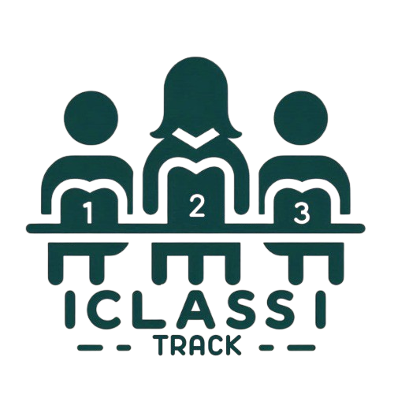

# 2024-3-ISC09-Automatic-Student-Detection-And-Attendance-Control

<p align="center">
  
</p>


## Overview

This monorepo contains multiple packages related to the **ClassTrack** application. The main packages are:

- `RaspberryApp`: Placeholder for Raspberry Pi related applications.
- `backend`: Backend API built with KeystoneJS.
- `ClassTrack`: Frontend application built with React Native.

## Repository Structure

### Packages

#### RaspberryApp

This directory is currently a placeholder for future Raspberry Pi related applications.

#### backend

This package contains the backend API for the ClassTrack application. It is built using KeystoneJS.

- **Main Files:**
  - `keystone.ts`: KeystoneJS configuration and setup.
  - `schema.graphql`: GraphQL schema definitions.
  - `schema.prisma`: Prisma schema definitions.

For more details, refer to the [README.md](packages/backend/README.md) in the `backend` directory.

#### ClassTrack

This package contains the frontend application for the ClassTrack platform. It is built using React.

- **Main Files:**
  - `app/`: Contains the main application layout and pages.
  - `assets/`: Contains fonts and images used in the application.
  - `components/`: Contains reusable React components.
  - `constants/`: Contains application-wide constants.
  - `hooks/`: Contains custom React hooks.
  - `scripts/`: Contains utility scripts.
  - `tsconfig.json`: TypeScript configuration file.
  - `babel.config.js`: Babel configuration file.

For more details, refer to the [README.md](packages/ClassTrack/README.md) in the `ClassTrack` directory.

## Getting Started

### Prerequisites

Before starting, make sure you have the following:

- **Node.js**
- **Yarn** or **npm**
- **Expo CLI** (for the frontend application)
- **Python 3** (for Raspberry Pi scripts)
- **Raspberry Pi** (for the hardware integration)

### Installation

1. Clone the repository:

        git clone <repository-url>
        cd 2024-3-ISC09-Deteccion-Automatica-de-Estudiantes-y-Control-de-Asistencia


2. Install dependencies for both **/backend** and **/ClassTrack**:

   If using **Yarn**:

        yarn install

   If using **NPM**:

        npm install


### Running the Applications

#### Backend (backend)

1. Navigate to the `backend` directory and start the KeystoneJS server:

   
        cd /backend

2. Dependign on what your're using:

    - Using Yarn:
        
        ```sh
        yarn start
        ```

    - Using NPM:
        
        ```sh
        npx keystone dev
        ```
        

#### Frontend (ClassTrack)

1. Navigate to the `ClassTrack` directory and start the React Native App:

        cd ClassTrack

2. Dependign on what your're using:

    - Using Yarn:
        
        ```sh
        yarn start
        ```

    - Using NPM:
        
        ```sh
        npx expo start
        ```
#### **RaspberryPi Setup (RaspberryApp)**

1. Clone the repository to your Raspberry Pi:

    ```sh
    git clone <repository-url>
        cd 2024-3-ISC09-Deteccion-Automatica-de-Estudiantes-y-Control-de-Asistencia/RaspberryApp
    ```

2. Install Python dependencies.

3. Run the Raspberry Pi scripts to activate the autoamtic student detection

    ```sh
    python3 main.py
    ```
---

